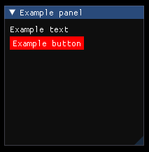

# ImGui-Markup
Layer above [ImGui](https://github.com/ocornut/imgui) with a simple markup language. <br/> The aim is to make it easier for developers and users of software using ImGui to change or develop the GUI. <br/>
With the markup language, the frontend is separated from the backend and enables easy access to the GUI for plugins or modders.
The markup is dynamically loaded at runtime, so most of the GUI changes does not require to recompile the project.<br/><br/>
Note: Currently the project is in such an early state that it cant be really used in a real application. There are still a lot of features missing and the project will propably change a lot in the future.
# Compile
Clone the repository and its submodules
```
git clone --recursive https://github.com/FluxxCode/ImGui-Markup.git
```
## Windows
Generate the project files
```
./scripts/vs2019_generate_project_files.bat
```
Alternatively, the project files can also be generated using ./premake/premake5.exe, which allows to select a different IDE than vs2019.
## Linux
### Ubuntu:
Dependencies if you only want to compile the lib:
```
sudo apt install make g++
```
Dependencies if you also want to compile the sandbox and example programs:
```
sudo apt install make g++ libglu1-mesa-dev xorg-dev freeglut3-dev
```
You can use following helper scripts to compile the project, including sandbox and example programs:
```
./scripst/gmake2_build_run_debug.sh
./scripst/gmake2_build_run_release.sh
```
# Examples
```cpp
// example.igm
Container : colors
{
    Float4 : red   { value = (1.0, 0.0, 0.0, 1.0) }
    Float4 : green { value = (0.0, 1.0, 0.0, 1.0) }
    Float4 : blue  { value = (0.0, 0.0, 1.0, 1.0) }
}

Panel
{
    position = (20, 20)
    size     = (200, 200)
    title    = "Example panel"

    StackView
    {
        padding = (10, 10)
        item_spacing = 10

        Text
        {
            text = "Example text"
        }

        Button : button_0  // <- Specifying the object ID so it can be accessed from the backend
        {
            text = "Example button"

            ButtonStyle
            {
                /**
                 * Accessing the values and attributes from another object
                 * defined in this file.
                */
                color         = @colors.red.value
                color_hovered = @colors.green.value
                color_active  = @colors.blue.value
            }
        }
    }
}
```
```cpp
// main.cpp
size_t example_file;

void Init()
{
    bool result;

    example_file = igm::ParseFile("example.ill", &result);

    if (!result)
        std::cerr << igm::GetLastError(example_file).message << std::endl;
}

// Main update function of the program, called every frame
void Update()
{
    igm::Update(example_file);

    if (igm::IsItemPressed(example_file, "button_0"))
        std::cout << "Button is pressed" << std::endl;
}
```

# TODOs
- Implement every missing ImGui feature
- System for language and style selection
- Different views to allow the alignment of items
- Unit tests
- and a lot more...
