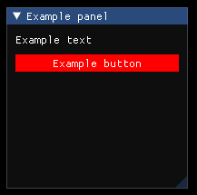

# imgui_layer
Object oriented layer above [ImGui](https://github.com/ocornut/imgui) with a simple markup language. <br/> The aim is to make it easier for developers and users of software using ImGui to change or develop the GUI. <br/>
With the markup language, the frontend is separated from the backend and enables easy access to the GUI for plugins or modders.
The markup is dynamically loaded at runtime, so most of the GUI changes does not require to recompile the project.<br/><br/>
"imgui_layer" is a temporary name until I find a suitable one. Feel free to share your ideas! <br/>
Note: Currently the project is in such an early state that it cant be really used in a real application. There is still a lot of features missing and the project will propably change a lot in the future.
# Compile
## Windows
...
## Linux
...
# Examples
```cpp
// panel.ill
Container : colors
{
    Float4 : red   { value = (1.0, 0.0, 0.0, 1.0) }
    Float4 : green { value = (0.0, 1.0, 0.0, 1.0) }
    Float4 : blue  { value = (0.0, 0.0, 1.0, 1.0) }
}

Panel
{
    position = (20, 20)
    size     = (200, 200)
    title    = "Example panel"

    Text { text = "Example text" }

    Button : button_0  // << Specifying the object ID so it can be accessed from the backend
    {
        text = "Example button"

        ButtonStyle
        {
            /**
             * Accessing the values and attributes from another object
             * defined in this file.
             * In this case we will access the 'value' attribute from the
             * child objects 'red', 'green' and 'blue' of the parent object
             * with an ID of 'colors'.
            */
            color         = colors.red.value
            color_hovered = colors.green.value
            color_active  = colors.blue.value
        }
    }
}
```
```cpp
// main.cpp
gui::GlobalObject example_file;

void Init()
{
    // Load the file and make sure that there are no errors
    gui::ParserResult result = gui::ParseFile("example.ill", example_file);
    if (resul.type_ != gui::ParserResultType::kSuccess)
        std::cerr << result.ToString() << std::endl;
}

// Main update function of the program, called every frame
void Update()
{
    example_file.Update();

    // Check if the object with the ID 'button_0' is pressed
    if (example_file.IsPressed("button_0"))
        std::cout << "Button is pressed" << std::endl;
}
```

# TODOs
- Implement every missing ImGui feature
- System for language and style selection
- Different views to allow the alignment of items
- Unit tests
- and a lot more...
