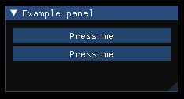

# Items
**Items:**
1. [Panel](#Panel)
    1. [PanelStyle](#PanelStyle)
1. [Text](#Text)
1. [Button](#Button)
    1. [ButtonStyle](#ButtonStyle)
1. [Checkbox](#Checkbox)
1. [ChildPanel](#ChildPanel)

**Other:**
1. [Container](#Container)
1. [Attribute type items](#AttributeTypeItems)

---
## Panel
### Description:
The panel is equal to ```ImGui::BeginWindow()``` and ```ImGui::EndWindow()```. It is used as the root of every drawable item and can only be created in the global file scope.
### Attributes:
| Name | Type | Description | Default Value |
| --- | --- | --- | --- |
| position | Float2 | The start position of the panel relative to the window | (0, 0) |
| size | Float2 | The start size of the panel | Dynamic size based on the size of the child items. |
| title | String | The title of the panel | "##<item_address>", which is displayed as an empty string. |
| no_title_bar | Bool | Disable title-bar | False |
| no_resize | Bool | Disable user resizing with the lower-right grip | False |
| no_move | Bool | Disable user moving the panel | False |
| no_scrollbar | Bool | Disable scrollbars. Panel can still scroll with mouse or programmatically. | False |
| no_scroll_with_mouse | Bool | Disable user vertically scrolling with mouse wheel. On child panel, mouse wheel will be forwarded to the parent unless NoScrollbar is also set. | False |
| no_collapse | Bool | Disable user collapsing panel by double-clicking on it. | False |
| always_auto_resize | Bool | Resize every panel to its content every frame. | False |
| no_background | Bool | Disable drawing background color and outside border. | False |
| no_mouse_inputs | Bool | Disable catching mouse, hovering test with pass through. | False |
| horizontal_scrollbar | Bool | Allow horizontal scrollbar to appear. | False |
| no_focus_on_appearing | Bool | Disable taking focus when transitioning from hidden to visible state. | False |
| no_bring_to_front_focus | Bool | Disable bringing panel to front when taking focus. | False |
| always_vertical_scrollbar | Bool | Always show vertical scrollbar. | False |
| always_horizontal_scrollbar | Bool | Always show horizontal scrollbar. | False |
| no_nav_inputs | Bool | No gamepad/keyboard navigation within the panel. | False |
| no_nav_focus | Bool | No focusing toward this panel with gamepad/keyboard navigation. | False |
| unsaved_document | Bool | Display a dot next to the title. | False |
| no_nav | Bool | Enables no_nav_inputs and no_nav_focus. | False |
| no_decoration | Bool | Enables no_title_bar, no_resize, no_scrollbar, no_collapse. | False |
| no_inputs | Bool | Enables no_mouse_inputs, no_nav_inputs, no_nav_focus. | False |
### Implemented API functions:
| Function | Description |
| --- | --- |
| ```bool IsPressed()``` | Returns true if the Panel is pressed by the user |
| ```bool IsHovered()``` | Returns true if the Panel is hovered by the user |
### Example:
```
// example.ill:

Panel
{
    title    = "Example panel"
    position = (300, 300)
    size     = (200, 200)

    Text { text = "This is a text inside the panel" }
}
```


---
## PanelStyle
### Description:
The panel style is used to change the apperance of a panel. Keep in mind that the PanelStyle can only be created inside a panel. The last defined PanelStyle is used if several are defined within a single panel.
### Attributes:
| Name | Type | Description | Default Value |
| --- | --- | --- | --- |
| background | Float4 | Panel background color | Global color is used |
| title_background | Float4 | Title background color | Global color is used |
| title_background_active | Float4 | Title background color when panel is active | Global color is used |
| title_background_collapsed | Float4 | Title background color when panel is collapsed | Global color is used |
| title_align | Float2 | Alignment of the panel title | Global alignment is used |
| scrollbar_background | Float4 | Scrollbar background color | Global color is used |
| scrollbar_grap | Float4 | Scrollbar grab color | Global color is used |
| scrollbar_grap_hovered | Float4 | Scrollbar grab color when hovered | Global color is used |
| scrollbar_grap_active | Float4 | Scrollbar grab color when pressed | Global color is used |
| padding | Float2 | Padding of the panel to its contents | Global padding is used |
| rounding | Float2 | Rounding of the panel edges | Global rounding is used |
| border_size | Float2 | Size of the panel border. Value of 0 means no color. | Global border size is used |
| border_color | Float2 | Color of the border | Global border color is used |
```
// example.ill:

Panel
{
    title = "Example panel"
    size  = (200, 200)

    PanelStyle
    {
        background       = (0.2, 0.3, 0.4, 1.0)
        title_background = (0.4, 0.2, 0.6, 1.0)
        border_color     = (0.5, 0.4, 0.9, 1.0)
        border_size      = 1
    }
}
```


---
## Text
### Description:
The text is equal to ```ImGui::Text()``` and is used to display information.
### Attributes:
| Name     | Type   | Description                                                  | Default Value           |
| ---------| ------ | ------------------------------------------------------------ | ----------------------- |
| text     | String | The Text that will be displayed                              |  "##<item_address>", which is displayed as an empty string. |
| color    | Float4 | The display color of the text                                | The global text color will be used |
### Implemented API functions:
| Function | Description |
| --- | --- |
| ```bool IsPressed()``` | Returns true if the Text is pressed by the user |
| ```bool IsHovered()``` | Returns true if the Text is hovered by the user |
### Example:
```
// example.ill:

Panel
{
    title    = "Example panel"
    position = (300, 300)
    size     = (250, 200)

    Text { text = "Some information" }
    Text
    {
        text = "Colored text"
        color = (0.7, 0.2, 0.5, 1.0)
    }
    Text
    {
        text = "Colored text"
        color = (0.2, 0.8, 0.2, 1.0)
    }
    Text
    {
        text = "Colored text"
        color = (0.3, 0.5, 0.8, 1.0)
    }
}
```


---
## Button
### Description:
The button is equal to ```ImGui::Button()```.
### Attributes:
| Name          | Type   | Description                                                    | Default Value                          |
| ------------- | ------ | -------------------------------------------------------------- | -------------------------------------- |
| text          | String | The text that is displayed inside the button                   |  "##<item_address>", which is displayed as an empty string. |
| size          | Float2 | Size of the button                                             | Size of the button contents            |
### Implemented API functions:
| Function | Description |
| --- | --- |
| ```bool IsPressed()``` | Returns true if the button is pressed by the user |
| ```bool IsHovered()``` | Returns true if the button is hovered by the user |
### Example:
```
// example.ill:

Panel
{
    title    = "Example panel"
    position = (300, 300)
    size     = (220, 110)

    Button : button_0
    {
        text = "Press me"
    }

    Button : button_1
    {
        text = "Press me"
        size = (200, 50)
    }
}
```
```cpp
// example.cpp
if (gui::IsPressed(file, "button_0"))
    std::cout << "button_0 is pressed" << std::endl;

if (gui::IsHovered(file, "button_1"))
    std::cout << "button_1 is pressed" << std::endl;
```


---
## ButtonStyle
### Description:
The button style is used to change the apperance of a button. Keep in mind that the ButtonStyle can only be created inside a button. The last defined ButtonStyle is used if several are defined within a single button.
### Attributes:
| Name | Type | Description | Default Value|
| --- | --- | --- | --- |
| color | Float4 | Default color of the button | Global button color is used |
| color_hovered | Float4 | Color of the button when it is hovered | Global button hovered color is used |
| color_active | Float4 | Color of the button when it is pressed | Global button active color is used |
| rounding | Float | Rounding of the button edges. Value between 0 and 12. | Global frame rounding is used |
| border_size | Float | Button border size. Value of 0 means no border. | Global frame border size is used |
| border_color | Float4 | Button border color | Global border color is used |
| border_shadow | Float4 | Border shadow color. Use an alpha value of 0 for no shadow. | Global border shadow color is used |
### Example:
```
// example.ill:

Panel
{
    title = "Example panel"
    size  = (130, 0)

    Button
    {
        text = "Green button"

        ButtonStyle
        {
            color         = (0.0, 1.0, 0.0, 1.0)
            color_hovered = (1.0, 0.0, 0.0, 1.0)
            color_active  = (0.0, 0.0, 1.0, 1.0)
            rounding      = 10
            border_size   = 1
            border_color  = (0.8, 0.3, 0.4, 1.0)
            border_shadow = (0.2, 0.2, 0.9, 0.5)
        }
    }
}
```


---
## Checkbox
### Description:
The checkbox is equal to ```ImGui::Checkbox()```.
### Attributes:
| Name | Type | Description | Default Value |
| ---| --- | --- | --- |
| text | String | Text that is displayed next to the checkbox | "##<item_address>", which is displayed as an empty string. |
| toggled | Bool | State of the checkbox when it's loaded | False |
### Implemented API functions:
| Function | Description |
| --- | --- |
| ```bool IsPressed()``` | Returns true if the checkbox or its text is pressed by the user. |
| ```bool IsHovered()``` | Returns true if the checkbox or its text is hovered by the user. |
| ```bool IsToggled()``` | Returns the state of the checkbox. |
### Example:
```
// example.ill:

Panel
{
    title    = "Example panel"
    position = (300, 300)
    size     = (220, 110)

    Checkbox : checkbox_0
    {
        text = "Test checkbox 1"
        toggled = false
    }

    Checkbox : checkbox_1
    {
        text = "Test checkbox 2"
        toggled = true
    }
}
```
```cpp
// example.cpp
if (gui::IsToggled(file, "checkbox_0"))
    std::cout << "checkbox_0 is toggled" << std::endl;

if (gui::IsToggled(file, "checkbox_1"))
    std::cout << "checkbox_1 is toggled" << std::endl;
```


---
## ChildPanel
### Description:
The ChildPanel is equal to ```ImGui::BeginChild()``` and ```ImGui::EndChild()```.
### Attributes:
| Name          | Type   | Description                                                         | Default Value                  |
| ------------- | ------ | ------------------------------------------------------------------- | ------------------------------ |
| size          | Float2 | The size of the child panel                                         | Size of the parent panel       |
| title         | String | The title of the child panel. |  "##<item_address>", which is displayed as an empty string. |
| border        | Bool   | Sets if a border should be drawn around the child panel             | False                          |
### Implemented API functions:
| Function | Description |
| --- | --- |
| ```bool IsPressed()``` | Returns true if the ChildPanel is pressed by the user |
| ```bool IsHovered()``` | Returns true if the ChildPanel is hovered by the user |
### Example:
```
// example.ill:

Panel
{
    title    = "Example panel"
    position = (300, 300)
    size     = (250, 200)

    ChildPanel : child_panel
    {
        border = true
        size   = (220, 60)

        Text { text = "Text inside the child panel" color = (0.7, 0.2, 0.5, 1.0) }
        Text { text = "Text inside the child panel" color = (0.2, 0.8, 0.2, 1.0) }
        Text { text = "Text inside the child panel" color = (0.3, 0.5, 0.8, 1.0) }
        Text { text = "Text inside the child panel" color = (0.5, 0.2, 0.8, 1.0) }
    }
}
```


---
## Container
### Description:
The container is used to store custom data and can only be created in the global file scope.
### Attributes:
*The container currently does not have any attributes*
### Example:
```
// example.ill:

Container : colors
{
    Float4 : red   { value = (1.0, 0.0, 0.0, 1.0) }
    Float4 : green { value = (0.0, 1.0, 0.0, 1.0) }
    Float4 : blue  { value = (0.0, 0.0, 1.0, 1.0) }
}

Panel
{
    title = "Container example"

    Text { text = "Red text"   color = @colors.red.value   }
    Text { text = "Green text" color = @colors.green.value }
    Text { text = "Blue text"  color = @colors.blue.value  }
}
```


---
## Attribute type items <a name="AttributeTypeItems"></a>
### Description:
The attribute type items are used to dynamically create values from the markup language. They represent every attribute type that exists in the markup language. This is useful to for exampel define colors and their values.
### Attributes:
| Name   | Description |
| ------ | ----------- |
| value  | Attribute that stores the custom value |
### Example:
```
// example.ill

Panel
{
    title = "Example"

    Bool   : bool    { value = true         }
    Float  : float   { value = 1.234        }
    Float2 : float_2 { value = (1, 2)       }
    Float3 : float_3 { value = (1, 2, 3)    }
    Float4 : float_4 { value = (1, 2, 3, 4) }
    Int    : int     { value = 1234         }
    String : string  { value = "String"     }

    Text { text = @bool.value    }
    Text { text = @float.value   }
    Text { text = @float_2.value }
    Text { text = @float_3.value }
    Text { text = @float_4.value }
    Text { text = @int.value     }
    Text { text = @string.value  }
}

Container : colors
{
    Float4 : red   { value = (1.0, 0.0, 0.0, 1.0) }
    Float4 : green { value = (0.0, 1.0, 0.0, 1.0) }
    Float4 : blue  { value = (0.0, 0.0, 1.0, 1.0) }
}

Panel
{
    title = "Color example"
    size = (100, 100)

    Text { text = "Red"   color = @colors.red.value   }
    Text { text = "Green" color = @colors.green.value }
    Text { text = "Blue"  color = @colors.blue.value  }
}
```


