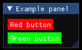
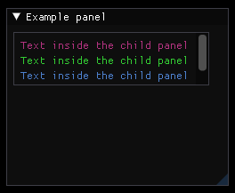
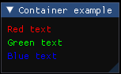
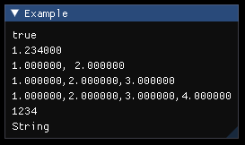
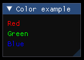

# Objects
1. [GlobalObject](#GlobalObject)
1. [Panel](#Panel)
1. [Text](#Text)
1. [Button](#Button)
1. [ButtonStyle](#ButtonStyle)
1. [ChildPanel](#ChildPanel)
1. [Container](#Container)
1. [Attribute type objects](#AttributeTypesObjects)

---
## GlobalObject
### Description:
The global object is automatically generated and used as the global scope of the file. It can be referenced by the object name "global". The attributes of the object are used to descripe the file. You cant create a global object manually.
### Attributes:
| Name        | Type   | Description                                                     | Default Value |
| ----------- | ------ | --------------------------------------------------------------- | ------------- |
| id          | String | The ID of the file, can be used to reference it in the backend. | ""            |
| version     | String | Version of the file                                             | ""            |
| description | String | Description of the file                                         | ""            |
| author      | String | Author of the file                                              | ""            |
| date        | String | Date when the file was changed                                  | ""            |
### Example:
```
# example.ill:

id          = "plugin_0"
version     = "1.2.3"
description = "Example file for the global object"
author      = "Max"
date        = "19.2.1980"

Panel
{
    title = "Panel_0"

    Text { text = global.id          }
    Text { text = global.version     }
    Text { text = global.description }
    Text { text = global.author      }
    Text { text = global.date        }
}
```

---
## Panel
### Description:
The panel is equal to ```ImGui::BeginWindow()``` and ```ImGui::EndWindow()```. It is necessary to draw other objects.
### Attributes:
| Name | Type | Description | Default Value |
| --- | --- | --- | --- |
| position | Float2 | The start position of the panel relative to the window | (0, 0) |
| size | Float2 | The start size of the panel | Based on the size of the child objects. |
| title | String | The title of the window wich is also used as the ImGui-ID, therefore it has to be unique and should be set, even if the panel has no titlebar. It can lead to unexpected behaviour when multiple panels have the same title. | If Object-ID is set, the Object-ID will be used as the title. If both title and Object-ID are not set, the title will be "unknown".
| no_title_bar | Bool | Disable title-bar | False |
| no_resize | Bool | Disable user resizing with the lower-right grip | False |
| no_move | Bool | Disable user moving the panel | False |
| no_scrollbar | Bool | Disable scrollbars. Window can still scroll with mouse or programmatically. | False |
| no_scroll_with_mouse | Bool | Disable user vertically scrolling with mouse wheel. On child window, mouse wheel will be forwarded to the parent unless NoScrollbar is also set. | False |
| no_collapse | Bool | Disable user collapsing window by double-clicking on it. | False |
| always_auto_resize | Bool | Resize every window to its content every frame. | False |
| no_background | Bool | Disable drawing background color (WindowBg, etc.) and outside border. | False |
| no_mouse_inputs | Bool | Disable catching mouse, hovering test with pass through. | False |
| horizontal_scrollbar | Bool | Allow horizontal scrollbar to appear. | False |
| no_focus_on_appearing | Bool | Disable taking focus when transitioning from hidden to visible state. | False |
| no_bring_to_front_focus | Bool | Disable bringing window to front when taking focus. | False |
| always_vertical_scrollbar | Bool | Always show vertical scrollbar. | False |
| always_horizontal_scrollbar | Bool | Always show horizontal scrollbar. | False |
| no_nav_inputs | Bool | No gamepad/keyboard navigation within the window. | False |
| no_nav_focus | Bool | No focusing toward this window with gamepad/keyboard navigation. | False |
| unsaved_document | Bool | Display a dot next to the title. | False |
| no_nav | Bool | Enables no_nav_inputs and no_nav_focus. | False |
| no_decoration | Bool | Enables no_title_bar, no_resize, no_scrollbar, no_collapse. | False |
| no_inputs | Bool | Enables no_mouse_inputs, no_nav_inputs, no_nav_focus. | False |
### Example:
```
# example.ill:

Panel
{
    title    = "Example panel"
    position = (300, 300)
    size     = (200, 200)

    Text { text = "This is a text inside the panel" }
}

// Title is "Title by attribute"
Panel
{
    title    = "Title by attribute"
    position = (510, 300)
    size     = (200, 200)
}

// Title is "title_by_object_id"
Panel : title_by_object_id
{
    position = (720, 300)
    size     = (200, 200)
}

// Title is "unknown"
Panel
{
    position = (930, 300)
    size     = (200, 200)
}
```


---
## Text
### Description:
The text is equal to ```ImGui::Text()``` and used to display information.
### Attributes:
| Name     | Type   | Description                                                  | Default Value           |
| ---------| ------ | ------------------------------------------------------------ | ----------------------- |
| text     | String | The Text that will be displayed                              | ""                      |
| color    | Float4 | The display color of the text                                | The global text color will be used |
### Example:
```
# example.ill:

Panel
{
    title    = "Example panel"
    position = (300, 300)
    size     = (250, 200)

    Text { text = "Some information" }
    Text
    {
        text = "Colored text"
        color = (0.7, 0.2, 0.5, 1.0)
    }
    Text
    {
        text = "Colored text"
        color = (0.2, 0.8, 0.2, 1.0)
    }
    Text
    {
        text = "Colored text"
        color = (0.3, 0.5, 0.8, 1.0)
    }
}
```


---
## Button
### Description:
The button is equal to ```ImGui::Button()``` and used to get input from the user.
### Attributes:
| Name          | Type   | Description                                                    | Default Value                          |
| ------------- | ------ | -------------------------------------------------------------- | -------------------------------------- |
| text          | String | The text that is displayed inside the button                   | ""                                     |
| size          | Float2 | Size of the button                                             | Size of the button contents            |
### Example:
```
# example.ill:

Panel
{
    title    = "Example panel"
    position = (300, 300)
    size     = (220, 110)

    Button
    {
        text = "Press me"
    }

    Button
    {
        text = "Press me"
        size = (200, 50)
    }
}
```


---
## ButtonStyle
### Description:
The button style is used to change the apperance of a button. Keep in mind that the ButtonStyle can only be created inside a button. The last defined ButtonStyle is used if several are defined within a single button.
### Attributes:
| Name | Type | Description | Default Value|
| --- | --- | --- | --- |
| color | Float4 | Default color of the button | Global button color is used |
| color_hovered | Float4 | Color of the button when it is hovered | Global button hovered color is used |
| color_active | Float4 | Color of the button when it is pressed | Global button active color is used |
| rounding | Float | Rounding of the button edges. Value between 0 and 12. | Global frame rounding is used |
| border_size | Float | Button border size. Value of 0 means no border. | Global frame border size is used |
| border_color | Float4 | Button border color | Global border color is used |
| border_shadow | Float4 | Border shadow color. Use an alpha value of 0 for no shadow. | Global border shadow color is used |
### Example:
```
# example.ill:

Panel
{
    title = "Example panel"
    size  = (130, 0)

    Button
    {
        text = "Green button"

        ButtonStyle
        {
            color         = (0.0, 1.0, 0.0, 1.0)
            color_hovered = (1.0, 0.0, 0.0, 1.0)
            color_active  = (0.0, 0.0, 1.0, 1.0)
            rounding      = 10
            border_size   = 1
            border_color  = (0.8, 0.3, 0.4, 1.0)
            border_shadow = (0.2, 0.2, 0.9, 0.5)
        }
    }
}
```


---
## ChildPanel
### Description:
The ChildPanel is equal to ```ImGui::BeginChild()``` and ```ImGui::EndChild()```.
### Attributes:
| Name          | Type   | Description                                                         | Default Value                  |
| ------------- | ------ | ------------------------------------------------------------------- | ------------------------------ |
| size          | Float2 | The size of the child panel                                         | Size of the parent panel       |
| title         | String | The title of the child panel wich is also used as the ImGui-ID, therefore it has to be unique and should be set. It can lead to unexpected behaviour when multiple child panels have the same title. | If Object-ID is set, the Object-ID will be used as the title. If both title and Object-ID are not set, the title will be "unknown". |
| border        | Bool   | Sets if a border should be drawn around the child panel             | False                          |
### Example:
```
# example.ill:

Panel
{
    title    = "Example panel"
    position = (300, 300)
    size     = (250, 200)

    ChildPanel : child_panel
    {
        border = true
        size   = (220, 60)

        Text { text = "Text inside the child panel" color = (0.7, 0.2, 0.5, 1.0) }
        Text { text = "Text inside the child panel" color = (0.2, 0.8, 0.2, 1.0) }
        Text { text = "Text inside the child panel" color = (0.3, 0.5, 0.8, 1.0) }
        Text { text = "Text inside the child panel" color = (0.5, 0.2, 0.8, 1.0) }
    }
}
```


---
## Container
### Description:
The container is used to store custom data or to divide other objects and object IDs.
### Attributes:
*The container currently does not have any attributes*
### Example:
```
# example.ill:

Container : colors
{
    Float4 : red   { value = (1.0, 0.0, 0.0, 1.0) }
    Float4 : green { value = (0.0, 1.0, 0.0, 1.0) }
    Float4 : blue  { value = (0.0, 0.0, 1.0, 1.0) }
}

Panel
{
    title = "Container example"

    Text { text = "Red text"   color = colors.red.value   }
    Text { text = "Green text" color = colors.green.value }
    Text { text = "Blue text"  color = colors.blue.value  }
}
```


---
## Attribute type objects <a name="AttributeTypesObjects"></a>
### Description:
The attribute type objects are used to dynamically create values from the markup language. They represent every attribute type that exists in the markup language. This is useful to for exampel define colors and their values.
### Attributes:
| Name   | Description |
| ------ | ----------- |
| value  | Attribute that stores the custom value |
### Example:
```
# example.ill

Panel
{
    title = "Example"

    Bool   : bool    { value = true         }
    Float  : float   { value = 1.234        }
    Float2 : float_2 { value = (1, 2)       }
    Float3 : float_3 { value = (1, 2, 3)    }
    Float4 : float_4 { value = (1, 2, 3, 4) }
    Int    : int     { value = 1234         }
    String : string  { value = "String"     }

    Text { text = bool.value    }
    Text { text = float.value   }
    Text { text = float_2.value }
    Text { text = float_3.value }
    Text { text = float_4.value }
    Text { text = int.value     }
    Text { text = string.value  }
}

Container : colors
{
    Float4 : red   { value = (1.0, 0.0, 0.0, 1.0) }
    Float4 : green { value = (0.0, 1.0, 0.0, 1.0) }
    Float4 : blue  { value = (0.0, 0.0, 1.0, 1.0) }
}

Panel
{
    title = "Color example"
    size = (100, 100)

    Text { text = "Red"   color = colors.red.value   }
    Text { text = "Green" color = colors.green.value }
    Text { text = "Blue"  color = colors.blue.value  }
}
```


