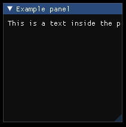
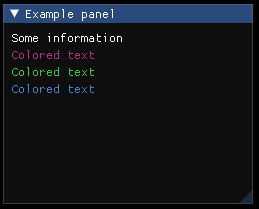
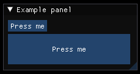

# Objects
1. [GlobalObject](#GlobalObject)
2. [Panel](#Panel)
3. [Text](#Text)
4. [Button](#Button)
---
## GlobalObject
### Description:
The global object is automatically generated and used as the global scope of the file. It can be referenced by the object name "global". The attributes of the object are used to descripe the file. You cant create a global object manually.
### Attributes:
| Name        | Type   | Description                                                     | Default Value |
| ----------- | ------ | --------------------------------------------------------------- | ------------- |
| id          | String | The ID of the file, can be used to reference it in the backend. | ""            |
| version     | String | Version of the file                                             | ""            |
| description | String | Description of the file                                         | ""            |
| author      | String | Author of the file                                              | ""            |
| date        | String | Date when the file was changed                                  | ""            |
### Example:
```
# example.ill:

id          = "plugin_0"
version     = "1.2.3"
description = "Example file for the global object"
author      = "Max"
date        = "19.2.1980"

Panel
{
    title = "Panel_0"

    Text { text = global.id          }
    Text { text = global.version     }
    Text { text = global.description }
    Text { text = global.author      }
    Text { text = global.date        }
}
```
---
## Panel
### Description:
The panel is equal to ```ImGui::BeginWindow()``` and ```ImGui::EndWindow()```. It is necessary to draw other objects.
### Attributes:
| Name     | Type   | Description | Default Value |
| ---------| ------ | ------------| --------------|
| position | Vec2   | The start position of the panel relative to the window | (0, 0) |
| size     | Vec2   | The start size of the panel | Based on the size of the child objects. |
| title    | String | The title of the window wich is also used as the ImGui-ID, therefore it has to be unique and should be set, even if the panel has no titlebar. It can lead to unexpected behaviour when multiple panels have the same title. | If Object-ID is set, the Object-ID will be used as the title. If both title and Object-ID are not set, the title will be "unknown".
### Example:
```
# example.ill:

Panel
{
    title    = "Example panel"
    position = (300, 300)
    size     = (200, 200)

    Text { text = "This is a text inside the panel" }
}

// Title is "Title by attribute"
Panel
{
    title    = "Title by attribute"
    position = (510, 300)
    size     = (200, 200)
}

// Title is "title_by_object_id"
Panel : title_by_object_id
{
    position = (720, 300)
    size     = (200, 200)
}

// Title is "unknown"
Panel
{
    position = (930, 300)
    size     = (200, 200)
}
```

---
## Text
### Description:
The text is equal to ```ImGui::Text()``` and used to display information.
### Attributes:
| Name     | Type   | Description                                                  | Default Value           |
| ---------| ------ | ------------------------------------------------------------ | ----------------------- |
| position | Vec2   | The start position of the text relative to the parent object | Current cursor position |
| text     | String | The Text that will be displayed                              | ""                      |
| color    | Vec4   | The display color of the text                                | The global text color will be used |
### Example:
```
# example.ill:

Panel
{
    title    = "Example panel"
    position = (300, 300)
    size     = (250, 200)

    Text { text = "Some information" }
    Text
    {
        text = "Colored text"
        color = (0.7, 0.2, 0.5, 1.0)
    }
    Text
    {
        text = "Colored text"
        color = (0.2, 0.8, 0.2, 1.0)
    }
    Text
    {
        text = "Colored text"
        color = (0.3, 0.5, 0.8, 1.0)
    }
    Text
    {
        position = (20, 150)
        text = "Text with a changed position"
        color = (0.3, 0.5, 0.8, 1.0)
    }
}
```

## Button
### Description:
The button is equal to ```ImGui::Button()``` and used to get input from the user.
### Attributes:
| Name          | Type   | Description                                                    | Default Value                          |
| ------------- | ------ | -------------------------------------------------------------- | -------------------------------------- |
| position      | Vec2   | The start position of the button relative to the parent object | Current cursor position                |
| size          | Vec2   | The size of the button                                         | Based on the size of the child objects |
| text          | String | The text that is displayed inside the button                   | ""                                     |
| color         | Vec4   | The default color of the button                                | Global button color is used            |
| color_hovered | Vec4   | The color of the button when it is hovered                     | Global button hovered color is used    |
| color_active  | Vec4   | The color of the button when it is pressed                     | Global button active color is used     |
### Example:
```
# example.ill:

Panel
{
    title    = "Example panel"
    position = (300, 300)
    size     = (250, 200)

    Button { text = "Press me" }
    Button
    {
        text     = "Colored button"
        color    = (0.3, 0.8, 0.7, 1)
        size     = (150, 80)
        position = (40, 80)
    }
}
```

